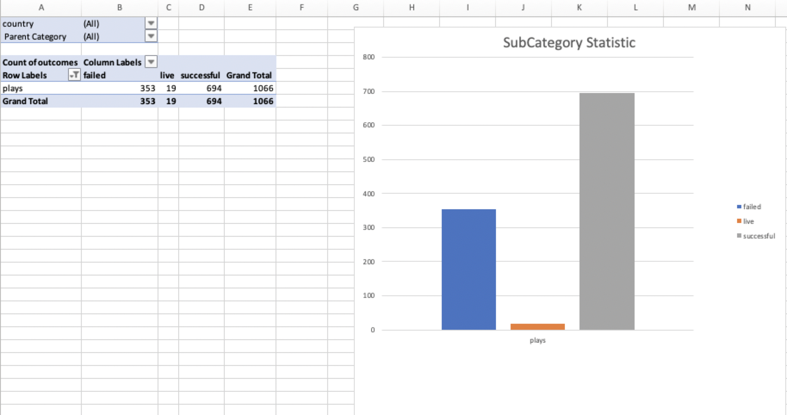
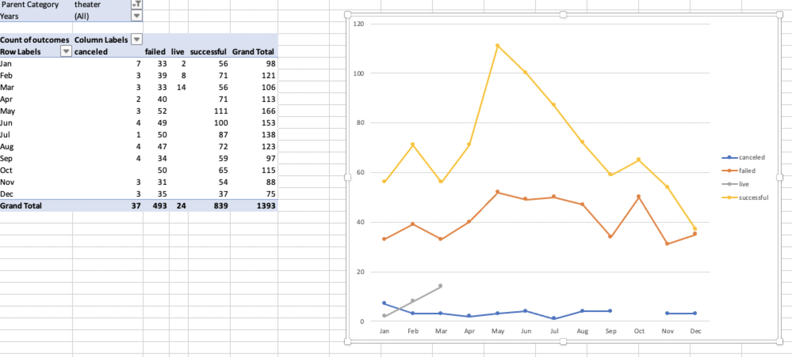
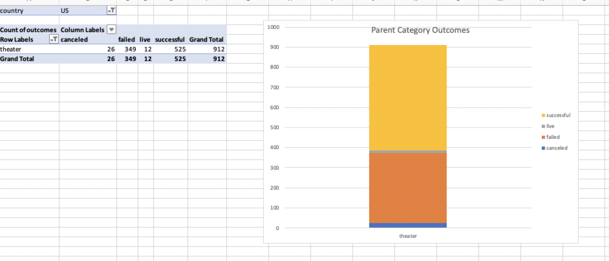

# Kickstarting with Excel

## Overview of Project
In this project, I am are helping Louise to start a crowdfunding campaign to
help her fund her play, Fever. She is estimating a budget of over $10,000.
Helping her to gain a greater understanding of campaign from start to finish.

### Purpose
I am using Excel to organize, sort and analyze crowdfunding data to determine
whether there are specific factors will make the campaign successful.

## Analysis and Challenges

Analysis: Since the data for determining whether there are specific factors
will make the campaign successful are too large. I are first trying to bread
the data into small pieced and filter out data I do not need. Therefore, in
order to better analyze the data, I did a Parent category statistic with only
the theater category left for the US, a subcategory statistic for plays only,
and outcomes based on Launch date. According to these three ways of analyzing
the data, I have find out that theater/plays have a higher chance of
successful, and I should launch the funding from June which will get the most
fund. Moreover, the multi data type had confused me a lot, but tried to test
what different data type will look like one by one to solve the problem.

### Analysis of Outcomes Based on Launch Date

I did a theater outcomes by launch date. I have filter the pivot table based
on "Parent Category" and "Years." And I placed the start date and outcomes
into the columns, rows, and values in appropriate. According to the result,
we should launch on June, and successful always greater than failure.

### Analysis of Outcomes Based on Goals

According to the analysis, the goal of range less than 1000 has the most highest
percentage of successful.

### Challenges and Difficulties Encountered

Challenges: I have encountered a problem of inserting the line chart of
percentage successful, percentage failed, percentage canceled into a line chart.
I original tried to first put the table1 into a pivot table and then generate
a line chart. But I find a easier way to just choose the columns I need to
directly generate a line chart. I have also met problems of switch the data
type from general to percentage, but solved it by googling online.

## Results

- What are two conclusions you can draw about the Outcomes based on Launch Date?

we should launch on June. successful always greater than failure.

- What can you conclude about the Outcomes based on Goals?

if the goal is less than 1000, we have higher successful rate

- What are some limitations of this dataset?

This dataset does not specify the currency used in goal, even though there are
different countries using different currency. Therefore, we should know if the
goal has convert the currency to one.

- What are some other possible tables and/or graphs that we could create?

we could create a table to determine which country will have higher rate of
successful to fund Louise's play.
